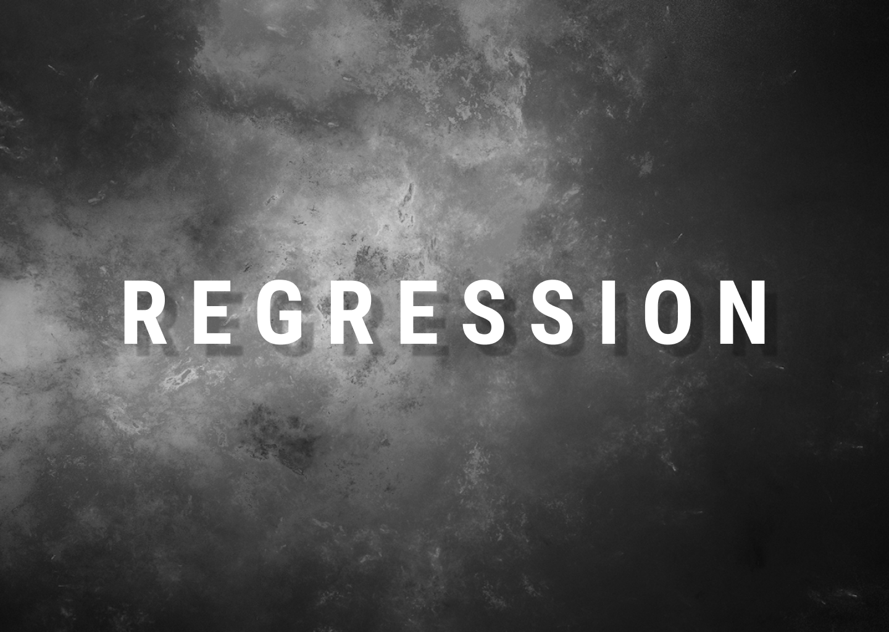

# Predicting Continuous Target Variable with Regression Analysis
---

## Background

Regression is a statistical tool used to understand and quantify the relation between two or more variables. Regressions range from simple models to highly complex equations. The two primary uses for regression in business are forecasting and optimization. This repository is for me to note concepts, and practice technical implementation from simple linear regression to advanced machine learning regression techniques. It will be useful for you to view if you are interested in comprehensive conceptual and technical explanation of Regression Analysis.

#### Contents Include:

1. Introducing Linear Regression
2. Exploring the Housing dataset
3. Implementing an ordinary least squares linear regression model
4. Fitting a robust regression model using RANSAC
5. Evaluating the performance of linear regression models
6. Using regularized methods for regression
7. Turning a linear regression model into a curve — polynomial regression
8. Dealing with nonlinear relationships using random forests

#### File 

1. [Regression Analysis Notes](https://github.com/danalain/Regression_Analysis/blob/main/Codes/Regression_Analysis_Notes.ipynb)

#### __Reference__: Python Machine Learning 3rd Edition by Sebatian Raschka & Vahid Mirkalili

---
### Written By

__Dana K Lain__, Profile: [LinkedIn](https://linkedin.com/in/dana-kyine-lain)